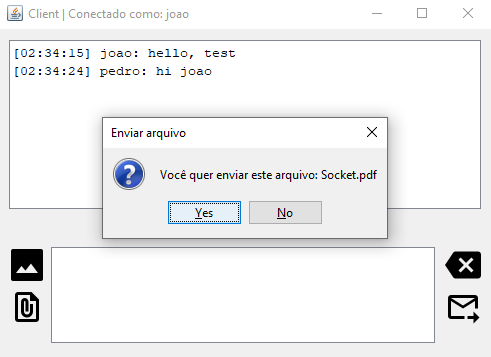

<h1 align="center">Socket Chat</h1>

<p align="center">
  <a href="#sobre">Sobre</a>&nbsp;&nbsp;&nbsp;|&nbsp;&nbsp;&nbsp;
  <a href="#preview">Preview</a>&nbsp;&nbsp;&nbsp;|&nbsp;&nbsp;&nbsp;
  <a href="#tecnologias">Tecnologias</a>&nbsp;&nbsp;&nbsp;|&nbsp;&nbsp;&nbsp;
  <a href="#building">Building</a>&nbsp;&nbsp;&nbsp;|&nbsp;&nbsp;&nbsp;
  <a href="#layout">Layout</a>&nbsp;&nbsp;&nbsp;|&nbsp;&nbsp;&nbsp;
  <a href="#contribuindo">Contribuindo</a>
</p>

## Sobre

Deverá ser criado uma aplicação que permita que duas ou mais pessoas possam se comunicar em uma rede, utilizando o protocolo TCP/IP. <br/>

A ferramenta terá que ser utilizada no seguinte caso: a Secretaria de Estado do Meio Ambiente deseja saber quais atividades industriais estão gerando poluição do Rio Tietê desde sua nascente em Salesópolis (SP) até a sua passagem pela região da grande São Paulo. Para tal ela precisa trocar informações das equipes de inspetores treinados e capacitados que estarão se revezando dentro de cada indústria, controlando os processos e passando informações online para a Secretaria.

## Preview
<p align="center">
    
    
    
</p>

## Tecnologias
Este projeto foi desenvolvido usando as seguintes tecnologias:

- [Java](https://www.java.com)
- [Socket](https://docs.oracle.com/javase/10/docs/api/java/net/Socket.html)
- [TCP-IP](https://www.cloudflare.com/learning/ddos/glossary/tcp-ip/)

## Building

Você vai precisar da [JDK 11](https://www.oracle.com/java/technologies/javase-jdk11-downloads.html) ou superior instalada em seu computador para poder compilar.

```bash
git clone https://github.com/eric-souzams/java-chat.git
$ cd java-chat

Após fazer a build dos arquivo, inicializar o servidor executando o StartServer.
Após inicializar e ligar o servidor, inicializar o client executando o StartClient.
```

## Contribuindo

Este repositório está atualmente em desenvolvimento. Se você quiser contribuir, faça um fork do repositório e coloque a mão na massa, faça as alterações conforme desejar e envie uma pull.
